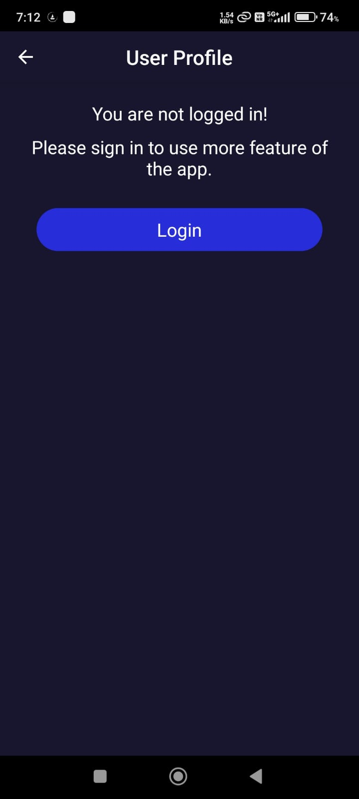

 

A mobile app project, built using <a href="https://reactnative.dev/">React Native ⚛️</a> & <a href="https://firebase.google.com/">Firebase 🔥</a>

## Features 🍿
+ Register or sign in using email and password.
+ Users can see movies's rating as well as other people's reviews. They can also rate and write their own reviews.
+ Movies's rating will be updated when a review is added. Swipe down to refresh the details. 
+ All the data is stored using Firebase.
+ A user can search the movie on which he want to See the review and also provide his reviews .

## Screenshots 🎬

    
    
    

 

    
    
    

 

    
    
    
    
    

## Download APK 📱
Download the Apk file from this repo by clicking the "review app.apk " in your mobile devices and download it . 